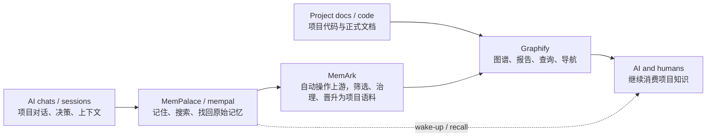

# MemArk

> 自动安装并操作 `MemPalace`、`mempal`、`Graphify`，把项目里的 AI 对话、决策和上下文变成后续 AI 和人都能继续消费的项目知识。

`MemArk` 面向用户提供的是一条项目级自动化闭环：自动安装上游、自动配置工作流、自动喂数据、自动加工数据，并在 `memark init` 之后把结果持续提供给项目里的 AI 消费。

上游项目：

- `MemPalace` GitHub: <https://github.com/milla-jovovich/mempalace>
- `Graphify` GitHub: <https://github.com/safishamsi/graphify>

## Sponsor

Sponsor placeholder.

If you want to sponsor `MemArk`, open an issue or contact the maintainer first.

## 为什么会想用它

如果你已经在用 AI 写项目，通常会遇到这几个问题：

- 聊天很多，但关键决策几天后就很难找回
- 原始会话太长，后续 AI 每次都要重新补上下文
- 只有记忆，没有整理；只有代码图，又吃不到过程知识
- 项目文档、代码、AI 对话、研究记录分散在不同地方，消费面不统一

`MemArk` 想解决的不是“再做一个 AI 工具”，而是这条断裂链路：

1. AI 对话里其实已经有很多项目知识
2. `MemPalace` / `mempal` 擅长把这些内容记住、找回、溯源
3. `Graphify` 擅长把稳定语料编译成图谱、报告和查询面
4. `MemArk` 自动操作这些上游，把中间这段真正跑通

一句话说，`MemArk` 解决的是：

让项目记忆不再只停留在聊天记录里，而是逐步变成后续 AI 和人都能继续使用的项目知识。

## 三者关系

可以把三者理解成一条流水线：



最短解释是：

- `MemPalace` / `mempal` 负责原始记忆能力
- `MemArk` 自动调用和编排这些能力，把原始记忆变成项目知识输入
- `Graphify` 提供图谱、报告、查询和导航这类消费面

## 它到底是什么

`MemArk` 不是新的记忆系统，也不是新的图谱引擎。

它对用户真正承诺的是一个 `CLI-first` 的自动化层：

- 自动安装并校验 `MemPalace`、`mempal`、`Graphify` 和 `MemArk` 自己的 runtime / skill bundle
- 自动配置这些工具之间的项目级工作流
- 自动把项目相关会话、项目文档和代码上下文送进正确的入口
- 自动把原始记忆加工成更适合 AI 和图谱继续消费的项目语料
- 自动把结果持续提供给项目中的 AI 使用，而不是只做一次 ingest 就结束

内部实现上，它仍然是桥接与治理层；但在用户视角里，更重要的是这五层自动化：

1. 自动安装
2. 自动配置
3. 自动喂数据
4. 自动加工
5. 自动消费

## 现在已经做到什么

当前仓库已经不是纯概念稿，而是一个可运行的最小实现，重点是：

- 自动安装用户级 `MemArk` runtime 和 AI skill bundle
- 自动初始化项目 workspace
- 自动同步 `Codex` / 会话目录输入
- 自动操作 `MemPalace` ingest 项目会话输入
- 自动把值得保留的项目记忆晋升为 `promoted` Markdown
- 自动提供本地 corpus 的 `query` / `context` 消费入口
- 在需要时自动触发或兼容构建本地图谱产物

但它也还不是“什么都自动完成”的最终形态。

当前更准确的口径是：

- 已有可运行主路径
- 已能自己吃自己的狗粮
- 已能解决一部分真实痛点
- 仍在继续收敛“默认体验应该是什么”

如果你想看更完整的能力边界，不应该把所有细节都塞在 `README`，继续看这些文档：

- 项目范围与定位：[`docs/PROJECT_SCOPE.md`](docs/PROJECT_SCOPE.md)
- 功能清单：[`docs/FEATURE_LIST.md`](docs/FEATURE_LIST.md)
- 重新评估：[`docs/MEMARK_REASSESSMENT.md`](docs/MEMARK_REASSESSMENT.md)

## 先给 AI 用

现在大多数场景下，最顺手的用法不是你先手抄命令，而是直接把安装文档交给 AI。

优先把下面两个文件之一直接给 AI：

- 正式用户安装入口：[`SKILL.md`](SKILL.md)
- 开发期隔离验收入口：[`skill-dev.md`](skill-dev.md)

你可以：

- 直接把文件内容贴给 AI
- 或把文档链接发给 AI
- 或告诉 AI 按这两个文件执行

人工手动执行时，也建议先看这两个文件：

- `SKILL.md` 负责正式安装与项目接入
- `skill-dev.md` 负责开发期重装、假 `HOME`、隔离验证

## 快速开始

```bash
# 安装 MemArk
python3 -m venv .memark-bootstrap
.memark-bootstrap/bin/python -m pip install --upgrade pip
.memark-bootstrap/bin/python -m pip install .
.memark-bootstrap/bin/python -m memark install --platform codex --source-spec "$(pwd)"
memark doctor --platform codex

# 在目标项目目录接入
cd your-project
memark init
```

`memark init` 默认会完成：

1. 创建 `.memark/` workspace
2. 注册项目
3. 安装后台调度
4. 执行首轮自动化 cycle

如果只想初始化 workspace，不自动装服务、不自动跑 cycle：

```bash
memark init --no-auto
```

## 安装和项目接入不是一回事

- `memark install`
  - 面向这台机器
  - 安装用户级 runtime 和 skill bundle
- `memark init`
  - 面向某个 workspace 或项目目录
  - 初始化本地状态并接入自动化
- `memark project-set`
  - 面向已经存在的 workspace
  - 给一个 workspace 追加或更新项目登记

所以通常是：

- 机器先执行一次 `memark install`
- 一个项目再执行一次 `memark init`
- 多项目共享 workspace 时，后续更多用 `memark project-set`

详情继续看：

- 正式安装入口：[`SKILL.md`](SKILL.md)
- 开发验证入口：[`skill-dev.md`](skill-dev.md)
- 安装验证记录：[`docs/INSTALL_VERIFICATION.md`](docs/INSTALL_VERIFICATION.md)

## 常用命令

- `memark doctor --platform codex`
  - 验证安装是否完整
- `memark init`
  - 在当前项目目录完成初始化
- `memark status --workspace . --json`
  - 查看项目状态
- `memark milestones --workspace . --json`
  - 查看当前阶段与阻塞项
- `memark context --workspace . --project <name>`
  - 输出 AI 可消费的项目上下文
- `memark query "<topic>" --workspace . --project <name>`
  - 搜索项目语料
- `memark automation-run --workspace .`
  - 手动跑一轮自动化 cycle
- `memark service-status --workspace . --json`
  - 查看后台调度状态

如果你想看更完整的命令面和边界，继续看：

- 接口与契约：[`docs/INTERFACE_CONTRACT.md`](docs/INTERFACE_CONTRACT.md)
- AI 消费模型：[`docs/AI_CONSUMPTION_MODEL.md`](docs/AI_CONSUMPTION_MODEL.md)

## 当前边界

当前仅支持 **macOS**。后台调度依赖 `launchd`。

`README` 只负责三件事：

- 一句话说明 `MemArk` 值不值得试
- 讲清楚它解决什么问题、现在做到哪里
- 把你导到更具体的安装、设计、研究、发布文档

不该继续堆在 `README` 的内容包括：

- 完整研究过程
- 全量设计推导
- 所有 CLI 细节
- 发布操作细则

这些内容都已经拆到专门文档里。

## 详细文档

- 项目范围与定位：[`docs/PROJECT_SCOPE.md`](docs/PROJECT_SCOPE.md)
- 功能清单：[`docs/FEATURE_LIST.md`](docs/FEATURE_LIST.md)
- 接口与边界：[`docs/INTERFACE_CONTRACT.md`](docs/INTERFACE_CONTRACT.md)
- AI 消费模型：[`docs/AI_CONSUMPTION_MODEL.md`](docs/AI_CONSUMPTION_MODEL.md)
- 安装验证：[`docs/INSTALL_VERIFICATION.md`](docs/INSTALL_VERIFICATION.md)
- MemPalace 调研：[`docs/RESEARCH_MEMPALACE_USAGE.md`](docs/RESEARCH_MEMPALACE_USAGE.md)
- `mempal` 调研：[`docs/RESEARCH_MEMPAL_EVALUATION.md`](docs/RESEARCH_MEMPAL_EVALUATION.md)
- Graphify 调研：[`docs/RESEARCH_GRAPHIFY_USAGE.md`](docs/RESEARCH_GRAPHIFY_USAGE.md)
- 重新评估：[`docs/MEMARK_REASSESSMENT.md`](docs/MEMARK_REASSESSMENT.md)
- Dogfood 运行：[`docs/DOGFOOD_RUNBOOK.md`](docs/DOGFOOD_RUNBOOK.md)
- 发布流程：[`docs/GITFLOW_RELEASE_FLOW.md`](docs/GITFLOW_RELEASE_FLOW.md)
- 发布检查：[`docs/RELEASE_CHECKLIST.md`](docs/RELEASE_CHECKLIST.md)

## 维护者说明

维护者做正式 Gitflow 发布时，统一参考 [`docs/GITFLOW_RELEASE_FLOW.md`](docs/GITFLOW_RELEASE_FLOW.md)。
