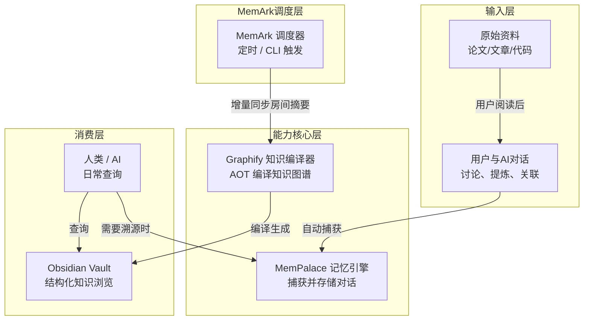

基于我们全部的讨论，我更新了 `README.md`，核心变化：

1. **明确 MemArk 是调度器**，连接 MemPalace 和 Graphify（作为 LLM Wiki 的落地实现）
2. **强调“先对话讨论，再编译”的工作流**：原始资料 → AI 对话消化 → MemPalace 捕获 → MemArk 调度 → Graphify 编译
3. **更新架构图**，体现三层职责
4. **命令调整**：`memark sync` 从 MemPalace 获取增量房间摘要，调用 Graphify 编译
5. **新增“推荐工作流”章节**，解释为什么先对话再编译更好

---

# MemArk

> 连接 MemPalace 和 Graphify 的轻量级调度器，实现“对话即知识”的自动化飞轮

MemArk 是一个**非侵入式中间件**，它让 MemPalace（动态对话记忆）和 Graphify（LLM Wiki 的落地实现）协同工作。**核心创新**：用户先与 AI 对话讨论原始资料（论文、文章等），对话被 MemPalace 自动捕获，然后 MemArk 定期将这些“加热过的思考”送入 Graphify，编译成结构化、可溯源的知识图谱。

## 核心理念

- **三层各司其职**：MemPalace 存储原始对话，Graphify 编译知识，MemArk 仅做调度适配
- **先对话，再编译**：原始资料先通过 AI 对话消化、提炼、关联，再被静态编译，信息密度和可读性远超直接丢文档
- **增量同步**：只处理新增对话，最小化开销
- **按需下钻**：Wiki 页面保留引用 ID，可一键回溯原始对话
- **自动化飞轮**：对话 → 记忆 → 摘要 → 知识图谱 → 查询/溯源，无需人工干预

## 架构图



## 推荐工作流：先对话，再编译

传统做法是直接把 PDF 丢进 `raw/`，让 LLM 自己消化。但这样做信息密度低、缺乏关联、可读性差。

**MemArk 的推荐工作流**：

1. 用户读到一篇论文或文章
2. 用户与 AI（ChatGPT、Claude 等）对话：
   - “这篇论文的核心观点是什么？”
   - “它和我们之前讨论的 X 有什么联系？”
   - “如果应用到我们的项目上，应该怎么改？”
3. AI 给出总结、对比、疑问、应用建议 —— 对话中自然产生了**高密度的洞察**
4. MemPalace 自动捕获整个对话（包括用户问题和 AI 回答）
5. MemArk 定时将对话中的“房间摘要”（已包含核心观点、链接、关联）提取出来
6. Graphify 将这些摘要编译成结构化的知识图谱，输出到 Obsidian Vault

**收益**：最终 Wiki 中的知识不是冰冷的原文摘录，而是**经过人类智慧 + AI 推理加热过的、可直接使用的洞察**。

## 快速开始

**将本目录下的 `skill.md` 交给 AI 助手**，它会自动完成全部安装配置。

或手动执行核心步骤：

```bash
# 1. 创建目录
mkdir -p ~/memark && cd ~/memark

# 2. 安装 MemPalace
pip install mempalace
mempalace init ~/memark/mempalace_data

# 3. 安装 Graphify（LLM Wiki 落地实现）
git clone https://github.com/Graphify/graphify ~/memark/graphify
cd ~/memark/graphify && pip install -e .

# 4. 下载 MemArk 脚本
curl -O https://raw.githubusercontent.com/memark/memark/main/memark.py
chmod +x memark.py

# 5. 首次同步
./memark.py sync
```

详细配置参考 [skill.md](./skill.md)。

## 使用指南

### 1. 开始对话（让 AI 帮你消化资料）

正常使用 ChatGPT、Claude 等工具讨论任何资料。**MemPalace 会自动记录所有对话**，无需额外操作。

### 2. 自动同步与编译

```bash
memark sync
```

这条命令会：
- 从 MemPalace 获取**增量房间摘要**（基于 `.last_sync` 时间戳）
- 将这些摘要（已包含核心观点、链接、关联）转换为 Graphify 接受的格式
- 触发 Graphify 编译生成知识图谱，输出到 Obsidian Vault

设置定时任务（每小时）：

```bash
echo "0 * * * * /home/$USER/memark/memark.py sync" | crontab -
```

### 3. 浏览知识库

用 **Obsidian** 打开 Graphify 输出的 Vault（默认 `~/memark/graphify_data/vault/`）：

- 按概念、主题浏览知识图谱
- 点击双向链接跳转
- 点击引用标记 `[^ref_room123]` 触发下钻（需配置）

### 4. 查询知识

```bash
memark query "记忆宫殿的设计原则"
```

先检索 Wiki 层（快速），如果需要原始对话中的具体措辞：

```bash
memark drill room_2025-03-15
```

该命令会调用 MemPalace MCP 获取完整对话记录。

## 目录结构

```
~/memark/
├── mempalace_data/          # MemPalace 数据库（原始对话）
├── graphify_data/
│   ├── raw/                 # 转换后的房间摘要（MemArk 写入）
│   └── vault/               # 编译后的知识图谱（Graphify 生成）
├── graphify/                # Graphify 源码
├── memark.py                # MemArk CLI
├── adapter.py               # 格式转换脚本
├── config.yaml              # 配置文件
├── .last_sync               # 增量同步时间戳
└── memark.log               # 日志
```

## 命令参考

| 命令 | 说明 |
|------|------|
| `memark sync` | 增量同步并触发 Graphify 编译 |
| `memark query "<问题>"` | 搜索知识图谱（通过 Graphify 检索） |
| `memark drill <room_id>` | 根据 ID 下钻到 MemPalace 原始对话 |
| `memark upgrade` | 升级 MemPalace 和 Graphify |

## 设计思想

### 为什么不是“另一个知识管理工具”？

MemArk **不做**以下事情：
- 不存储原始数据（交给 MemPalace）
- 不编译知识（交给 Graphify）
- 不做摘要提取（交给 AI 对话和 MemPalace 的 AAAK）

MemArk **只做**：
- 定时调度
- 格式适配
- 触发编译
- 统一查询入口

### 增量同步的简单性

使用 `.last_sync` 文件记录上次同步时间戳，每次只拉取 `timestamp > last_sync` 的房间摘要。不需要复杂的状态数据库。

### 下钻的实现

Wiki 页面中的 `[^ref_room123]` 是保留的引用 ID。Obsidian 可配置自定义命令：

```json
{
  "command": "memark drill {id}"
}
```

点击即可获取原始对话。

## 与 Graphify 的关系

- **Graphify** 是 LLM Wiki 理念的完整落地实现，提供 AOT 编译、并行 LLM 子代理、Token 节省 71.5 倍等能力
- **MemArk** 不重复实现这些能力，而是**调度** MemPalace 的输出作为 Graphify 的输入
- 两者结合：Graphify 处理静态文档，MemArk 将动态对话也送入 Graphify，实现全谱知识编译

## 未来扩展

- [ ] 官方 PyPI 包：`pip install memark`
- [ ] Obsidian 插件：一键下钻、高亮溯源
- [ ] 支持 Graphify 的增量编译模式
- [ ] Web UI 管理界面

## 许可证

MIT

## 相关项目

- [MemPalace](https://github.com/milla-jovovich/mempalace) – 完美记忆宫殿
- [Graphify](https://github.com/Graphify/graphify) – LLM Wiki 的落地实现，Token 消耗降低 71.5 倍
- [Obsidian](https://obsidian.md) – 知识浏览界面

---

**MemArk：让对话成为知识，让记忆触手可及。**